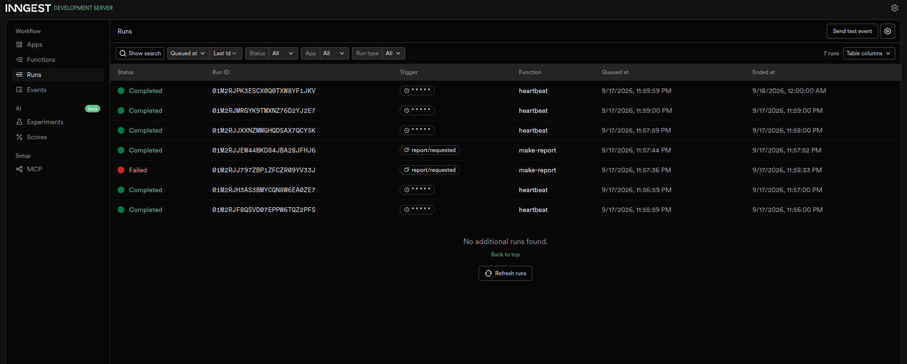

# Background Job API

A small Express + TypeScript API demonstrating background jobs with Inngest.

The API accepts report requests immediately with `202 Accepted`, while the slow report generation runs in the background. Clients can poll the report status until the job is complete.

## How to Run

### 1. Start the API

```bash
npm i
npm run dev
```

The API runs on:

```text
http://localhost:3000
```

### 2. Start the Inngest Dev Server

In a second terminal:

```bash
npx inngest-cli@latest dev -u http://localhost:3000/api/inngest
```

The Inngest dashboard is available at:

```text
http://localhost:8288
```

## Endpoints and Background Functions

| Type    | Name           | Description                                                        |
| ------- | -------------- | ------------------------------------------------------------------ |
| GET     | `/health`      | Health check                                                       |
| POST    | `/reports`     | Accepts a report request and starts background processing          |
| GET     | `/reports/:id` | Returns the current report status                                  |
| Inngest | `say-hello`    | Test background function with a 5-second sleep                     |
| Inngest | `make-report`  | Processes a report request with an 8-second background task        |
| Inngest | `heartbeat`    | Runs every minute and logs pending, done, and failed report counts |

## Background Job Flow

A report request follows this flow:

```text
POST /reports
      |
      | 202 Accepted
      v
status: pending
      |
      | report/requested event
      v
Inngest make-report
      |
      | sleep 8 seconds
      v
build-report
      |
      v
status: done
```

The HTTP request does not wait for the slow work. The client can poll `GET /reports/:id` to observe the status.

## 202 Accepted Proof

Create a report:

```bash
curl -i -X POST http://localhost:3000/reports \
  -H "Content-Type: application/json" \
  -d '{"topic":"cats"}'
```

Response:

```text
HTTP/1.1 202 Accepted
```

```json
{
  "id": "351f5087-4511-4281-9a58-6e6619f83657",
  "status": "pending"
}
```

Immediately poll the report:

```bash
curl http://localhost:3000/reports/:id
```

Response:

```json
{
  "id": "351f5087-4511-4281-9a58-6e6619f83657",
  "topic": "cats",
  "status": "pending"
}
```

After approximately 10 seconds, poll again:

```bash
curl http://localhost:3000/reports/:id
```

Response:

```json
{
  "id": "351f5087-4511-4281-9a58-6e6619f83657",
  "topic": "cats",
  "status": "done",
  "result": "Report about cats is ready."
}
```

## Retries and Validation

Invalid input is rejected at the API boundary without creating a job, while valid jobs that fail because of temporary problems are retried automatically.

For example, a report with the topic `fail` causes the background `make-report` function to fail and Inngest retries it twice, resulting in three total attempts.

A request without a topic is rejected with `400 Bad Request` and no background event is sent.

## Cron Heartbeat

The `heartbeat` function runs every minute using:

```text
* * * * *
```

It logs the number of pending, done, and failed reports.

The cron expression for every day at 08:00 is:

```text
0 8 * * *
```

The cron expression for every Sunday at 22:00 is:

```text
0 22 * * 0
```

## Dashboard

The Inngest dashboard shows the background function runs, including the scheduled heartbeat runs.



## Environment

For local development, create a `.env` file containing:

```env
INNGEST_DEV=1
```

The `.env` file is intentionally excluded from Git.

## Tech Stack

- Node.js
- TypeScript
- Express
- Inngest

## Note

Invalid input is rejected at the API boundary without creating a job, while valid jobs that fail because of temporary problems are retried automatically.

## Cron examples

`0 8 * * *` runs the heartbeat every day at 08:00.

`0 22 * * 0` runs the heartbeat every Sunday at 22:00.

The five fields are:

minute hour day-of-month number-of-month day-of-week

So:

```
0 8 * * *
│ │
│ └── 08:00
└──── minute 0
```

and:

```
0 22 * * 0
│ │      │
│ │      └── Sunday
│ └───────── 22:00
└──────────── minute 0
```
